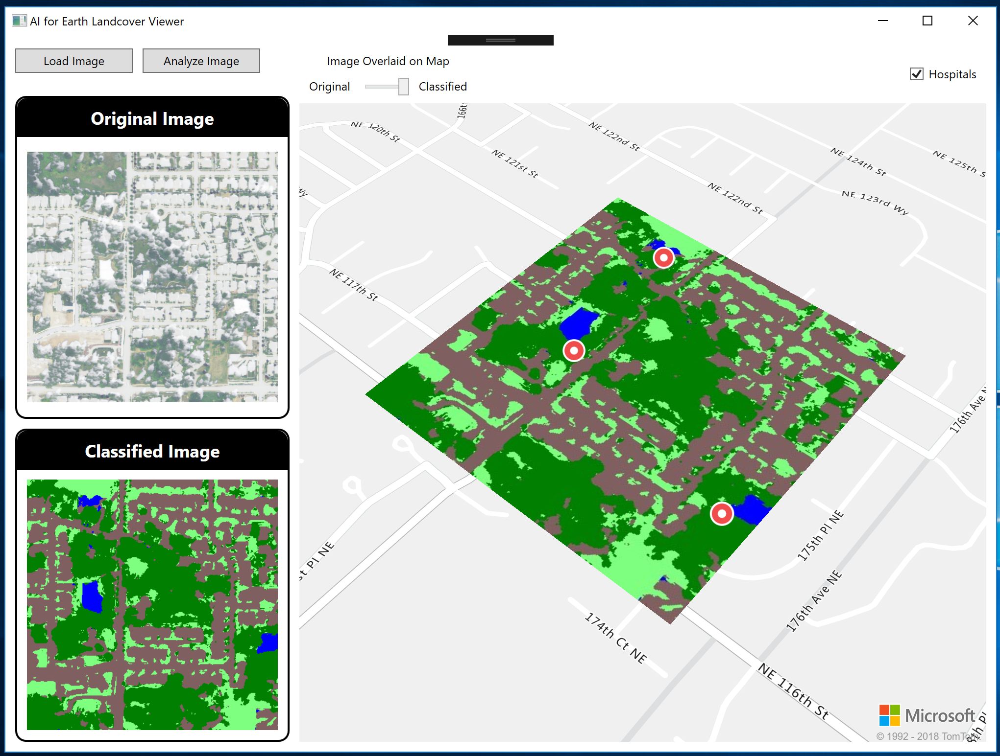

# Premonition Placement

This code demonstrates calling the AI for Earth land cover API, in an example use case involving [Project Premonition](https://www.microsoft.com/en-us/research/project/project-premonition/).  Project Premonition is a research project that seeks to predict the outbreak and spread of disease.  It accomplishes this by capturing mosquitoes using smart traps that can differentiate between mosquitoes and other insects, so only mosquitoes are captured.  Then, using the blood that the mosquitoes have collected, we can determine what animal it came from and what diseases they carry.  

In this demo, let's assume that we need to find the optimal position to place these traps, in regions that have more dense mosquito populations.  Mosquitoes lay eggs in water and also congregate in forested areas, so we are going to use the AI for Earth land cover API to scan a large section of land to find an appropriate place.  (Note: this demo is an example use case only and not the real logic used by the Project Premonition research team to place the smart traps.)

This demo makes use of the [AI for Earth Land Cover](https://www.microsoft.com/en-us/aiforearth/land-cover-mapping.aspx) API as well as the [Azure Maps platform](https://aka.ms/AzureMaps). 

## Setup

1. Sign up for an AI for Earth subscription key.  (The AI for Earth APIs are currently in private preview.  To request access and obtain a key, email aiforearthapi@microsoft.com with details of your use case, geographic area of interest, anticipated number of calls per unit time, and if you are willing to provide us feedback to improve the API.)  
2. Sign up for an Azure Maps subscription key ([details](https://docs.microsoft.com/en-us/azure/location-based-services/how-to-manage-account-keys)).
3. Add these subscription keys into the appropriate appSetting in the App.config file of the project. 
4. This demo does not work with the "Any CPU" setting in Visual Studio. If you have issues running this demo, change the platform target to x86 or x64 by right-clicking on the solution, then select "Configuration Manager", and set the "Active solution platform" to x86 or x64.

## Resources
+ [AI for Earth website](http://aka.ms/aiforearth)
+ [AI for Earth land cover mapping](https://www.microsoft.com/en-us/aiforearth/land-cover-mapping.aspx)
+ [AI for Earth API documentation](http://aka.ms/aieapisdoc)

